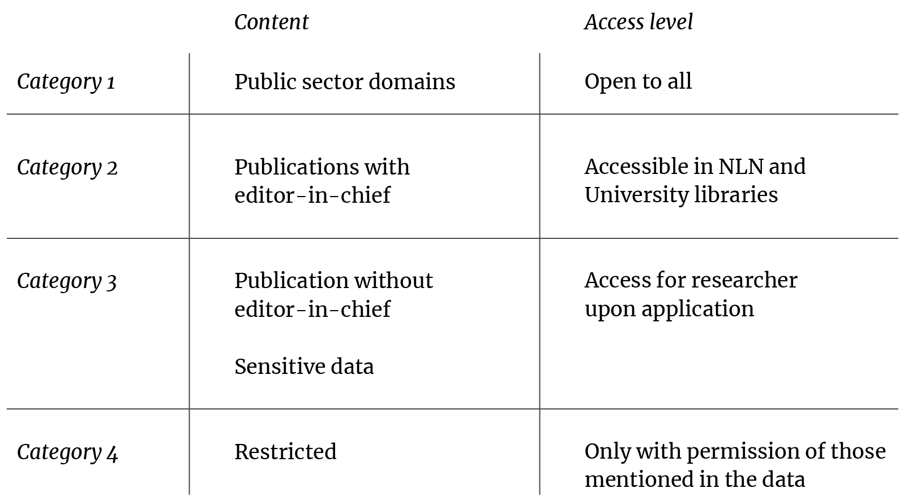

# Researcher Access
The Norwegian Web Archive (NWA) rely on a multi-layer model for access. With a relevant project, researchers can get access to the vast majority of the NWA collection.
{: .fs-6 .fw-300 }

## A Multi-Layer Model for Access
Who can access to what in the Norwegian Web Archive?

We rely on a model for multi-layered access, suggested in the preparations of the current Legal Deposit Act from 2016:

**CATEGORY 1** concern websites published by governmental and public sector entities. This is considered to be open data, and we are working on the technical solution to publish this openly on the web. We are not quite there yet, but there is work in progress.

**CATEGORY 2** includes publications with a responsible editors-in-chief. Documents from these domains can be made available at the National Library, and in University Libraries around the country.

**CATEGORY 3** involves all other websites which lack a responsible editor-in-chief, OR that include personal sensitive data not regarded as widely known.

Access to Category 3 is restricted to researchers upon application. As a scholar (at least having started a PhD), you can apply for access with a relevant research project.

If granted access on this premise, we will enter upon an agreement that includes Terms and Conditions for the use of our services. You need to provide a plan for data management and take responsibility for the data management. All research and utilisation are expected to follow NESH' [Guide for Internet Research Ethics](../images/forskningsetisk-veileder-for-internettforskning-2018-interaktiv.pdf). 

**CATEGORY 4** is currently only a handful of resources, mainly some medical journals that a hospital accidentally published.

## Apply for Access
Currently, you apply for access to nettarkivet@nb.no with information about your affiliation and a description of your research project.

----

*The image above is created with MidJourney, entering the following prompt: `Digital art with hundreds of computers popping up in a Norwegian landscape --ar 2:1.`*