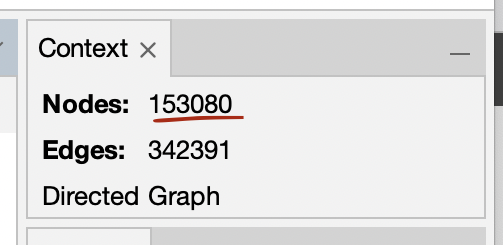

# Gephi
Gephi allow you to visualise networks, such as domain clusters and relations between domains.
{: .fs-6 .fw-300 }

Gephi is an open-source software for network exploration and visualisation.[^1] It has been used in a number of projects, both inside and outside of adademia, e.g. in studies of Twitter network traffic during the terror attacks in Norway, 22 July 2011.[^2]

Before you start, you will need to export data from SolrWayback. To learn more about exporting data from SolWayback to Gephi, see [Link graph Gephi export](./solrwayback/features#link-graph-gephi-export)

## Open Gephi
From the virtual desktop, double-click the Gephi icon.

## Import data from SolrWayback
Go to "File" -> "Open".

Select the .csv file you exported from SolrWayback, and click "Next" -> "Finished" -> "Ok"

## Overview tab
In the "Overview" tab in the top right corner, check the number of #nodes.

If there more than 10.000 nodes, consider to make a new export from SolrWayback with a more fine-tuned query.
Alternatively, open the "Filter" tab (right), choose "Topology", and drag "Giant component" down to filters. Click "▸ Filter".

*The number of nodes are shown in the top right corner.*

*The "Giant component" filter can be dragged down to the filters.*

*Click "▸ Filter" to apply the filter.*

## Select layout
In the "Layout" tab on the left, choose "Yifan Hu" as your layout.

Then click "▸ Run" and wait.

 

Click "Run" until you are happy with how the visual distribution of the nodes.

(For graphs with 1 million nodes, this can take hours. So you are strongly encouraged to scope down the amount of nodes, during this workshop!)

## Statistics
In the "Statistics" tab, find "Network diameter" and press "Run".

Then, find "Modularity" and press "Run".

## Define Appearance
In the "Appearance" tab, click "Nodes".

Click the color palette icon (🎨). Choose "Partition", and then as "Attribute" you choose "Modularity class".

Click "▸ Apply"

## Adjust text
Still in the "Appearance" tab, click label size (tT).

Then, press ranking, an as attribute you choose "Betweeness centrality".

## Preview
To preview the network graph, go to "Preview" mode.

Down to the left, press "🔄 Refresh".

## Export graph
To export the graph, click "File > Export > SVG/PDF/PNG file".

Choose the desired format, and click "Export".

[//]: # (## Further utilisation: If you export as an SVG, it is possible to use The Danish Royal Library's [GraphPresenter]() [^2] to convert SVGs into an interactive, zoomable image that can be presented in a browser. At the moment, this is not supported in NWA's virtual environment.)

----

[^1]: This guide only contain a tiny demonstration of how you can import data from SolrWayback to Gephi and visualise the data. If you want to learn more about the possibilities for network analysis in Gephi, please visit [Learn how to use Gephi](https://gephi.org/users/).

[^2]: [Aouragh, Miriyam (2011), "Collateral Damage: #Oslo Attacks and Proliferating Islamophobia", Jadaliyya](https://www.jadaliyya.com/Details/24298/Collateral-Damage-#Oslo-Attacks-and-Proliferating-Islamophobia).

