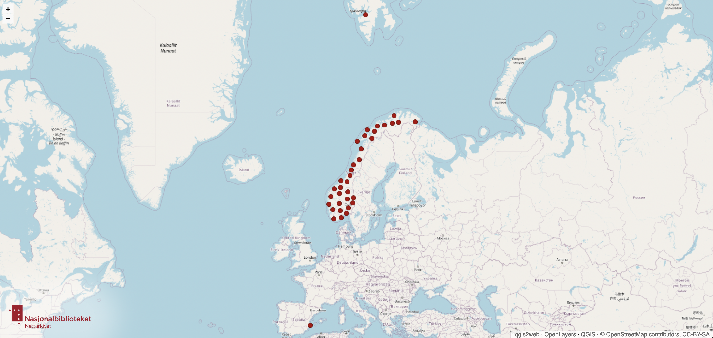

# Map Services
Lorem ipsum dolor sit amet, consectetur adipiscing elit, sed do eiusmod tempor incididunt ut labore et dolore magna aliqua.
{: .fs-6 .fw-300 }

## Table of content
1. [Norwegian Web News](#norwegian-web-news)
2. [Norwegian Governmental Entities](#norwegian-governmental-entities)
3. [Datasets](#datasets)

## Norwegian Web News
Lorem ipsum dolor sit amet, consectetur adipiscing elit, sed do eiusmod tempor incididunt ut labore et dolore magna aliqua. Ut enim ad minim veniam, quis nostrud exercitation ullamco laboris nisi ut aliquip ex ea commodo consequat. 

The map is available at the [Norwegian Web Archive's Map of Web News](https://nettarkivet.beta.nb.no/map/)

## Norwegian Governmental Entities
Lorem ipsum dolor sit amet, consectetur adipiscing elit, sed do eiusmod tempor incididunt ut labore et dolore magna aliqua. Ut enim ad minim veniam, quis nostrud exercitation ullamco laboris nisi ut aliquip ex ea commodo consequat. 

You can use the map through our [online service](https://nettarkivet.beta.nb.no/map/)

## Datasets
Lorem ipsum dolor sit amet, consectetur adipiscing elit, sed do eiusmod tempor incididunt ut labore et dolore magna aliqua. Ut enim ad minim veniam, quis nostrud exercitation ullamco laboris nisi ut aliquip ex ea commodo consequat. Duis aute irure dolor in reprehenderit in voluptate velit esse cillum dolore eu fugiat nulla pariatur. Excepteur sint occaecat cupidatat non proident, sunt in culpa qui officia deserunt mollit anim id est laborum.

----

All data about entities and addresses have been extracted from the [Norwegian Entity Register](https://data.brreg.no/enhetsregisteret/api/docs/index.html).

The entities' street addresses have been parsed into geo coordinates, using [Google's Geocoding API](https://developers.google.com/maps/documentation/geocoding/overview).

The map is produced with [QGIS 3.24](https://qgis.org/en/site/), using the [qgis2web](https://github.com/tomchadwin/qgis2web) plugin with [OpenLayers](https://openlayers.org/) and map tiles from [OpenStreetMap](https://www.openstreetmap.org) to produce web resources, with some post-editing of html, css and js.