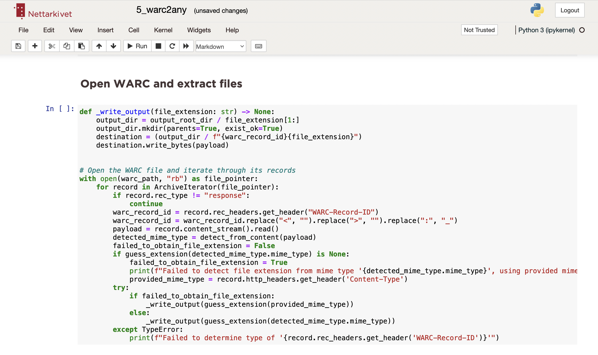
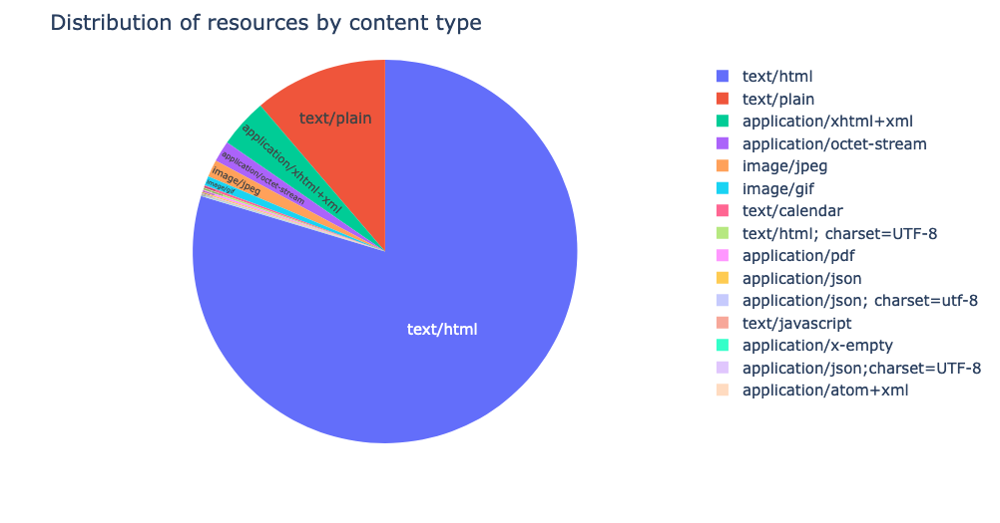
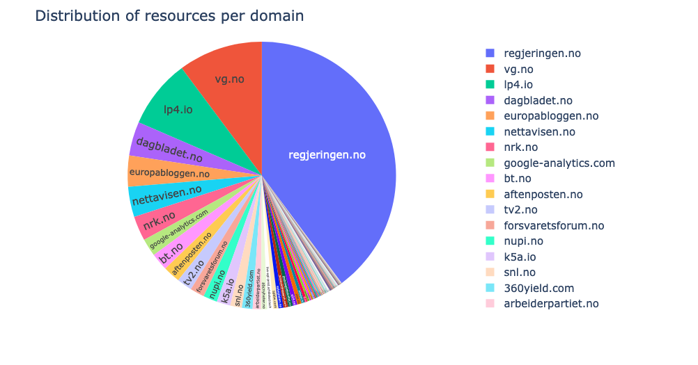
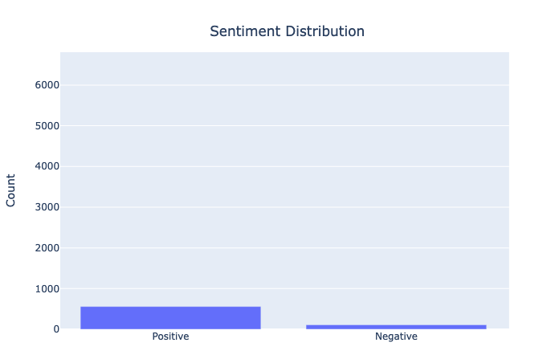

# NWA notebooks
The NWA notebooks provide tools for insight and analysis of derivatives from SolrWayback. It is currently experimential.
{: .fs-6 .fw-300 }

## Table of contents
1. [NWA Notebooks](#nwa-notebooks)
2. [Open a notebook](#)
3. [Run the cells](#)
4. [Installed packages]

## NWA Notebooks
The idea of the NWA Notebooks is to enable non-programmers to utilise the strengths of computation.[^1]

Currently, we offer four notebooks:

### 1_Insight_Domains_ContentType_Year.ipynb

A notebook to explore your search result. It count and visualise the number of domains, media types and distribution over years in your JSONL export.

### 2_Insight_DetectVersionVsUniqueResources.ipynb

A notebook to explore your search result. It count and visualise the number of resources with unique URLs and the number of resources that are "versions" of the same URL in your JSONL export.

### 3a_SentimentAnalysis_WebpageTitles_regjeringen-no.ipynb

A notebook to explore the sentiments of HTML titles in your JSONL export. The approach is naive and context-less, but it can give you an indication of the sentiment of the titles.

### 4_warc2file.ipynb`

Let you convert the WARC records to files. Helpful if you want to inspect the elements by themselves, or maybe want to do machine learning.

## Run a notebook
To open a notebook, you can start Anaconda Navigator.

From there, launch "Jupyter notebook".

## Run the cells

## Installed packages
    - [package-name](#)
    - [package-name](#)
    - [package-name](#)
    - [package-name](#)
    - [package-name](#)
    - [package-name](#)
    - [package-name](#)
    - [package-name](#)
    - [package-name](#)
    - [package-name](#)
    - [package-name](#)
    - [package-name](#)

---
[^1]: The notebooks are written in Python, and use the Jupyter Notebook environment. The notebooks are written in a way that should be easy to understand and use, even if you have no experience with programming.