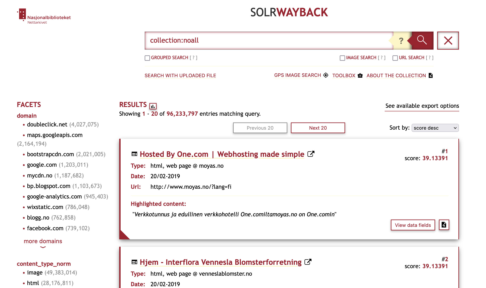

# SolrWayback
SolrWayback is a service offering advanced tools to explore the Norwegian Web Archive.
{: .fs-6 .fw-300 }

#### Table of content
1. [Get started](./solrwayback/get-started)
2. [Search](./solrwayback/search)
    - [Search modes](./solrwayback/search/search-modes)
    - [Search synthax](./solrwayback/search/search-synthax)
    - [Field descriptions](./solrwayback/search/fields)
3. [Features & Tools](./solrwayback/features)
4. [Export search results](./solrwayback/export)

## Main features
Some of SolrWayback's main features are:
- Full-text search
- Metadata search
- Image search
- Features for insight and analysis
- Export of search results

## Credits
SolrWayback is a bundle of technologies, developed and maintained by the Royal Danish Library.[^1]

## Version
Current installation of SolrWayback is version 4.4.2

----

[^1]: SolrWayback is open source and available through [GitHub](https://github.com/netarchivesuite/solrwayback/).