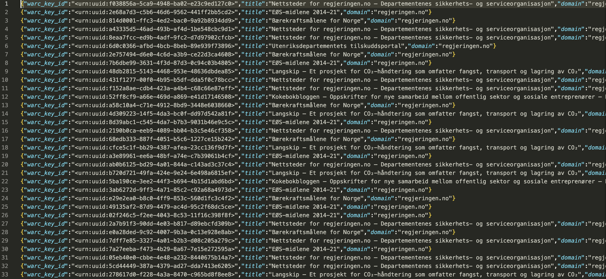

# Export Search Results
SolrWayback have features for exporting your search results in different formats. This allow you to analyse or process the data further with a variety of software and techniques.
{: .fs-6 .fw-300 }

## Table of content
1. [CSV/JSONL export](#csvjsonl-export)
2. [WARC export](#warc-export)

## Exporting data
To export a search result, move your mouse pointer over "See available export options". A dropdown list with different alternatives will appear.

### CSV/JSONL export
Exporting your search result as CSV/JSONL basically means to produce a derivative, based on your results.

This is valuable for a lot of reasons:
- You can use it to define a corpus
- You can extract relevant metadata for analysis
- You can extract the full-text from documents, created by Apache Tika

If you choose to export with JSONL as output format, you can use the [NWA notebooks](../notebooks) the investigate the data.

If you are more familiar with sheets, you can also export CSV and open them in LibreOffice Calc (similar to Excel).

#### Rename the output
The output will have a generic name, `solrwayback_{time-of-export}`. To document and keep track of your exports, we recommend to rename the files to something more meaningful, e.g. containing the query phrase that was used to produce the results.

E.g. `JonasGahrStore_domain-regjeringen-no_content-type-norm-html.jsonl`.

## WARC export
The WARC (Web ARChive) format is an international standard for storing data archived from the web.

There are several reasons to export search results in the WARC format:
- Extract the archived objects (e.g. html or png files) and process these computationally. (see [Notebook 4_warc2file](../notebooks#4-warc2file))
- You want to inspect technical aspects of the archival records, beyond the data and metadata that are indexed in SolrWayback (e.g. with [Warchaeology](../warchaeology) in the command-line)

*NOTICE: We recommend NOT to download `Expanded WARC`. This is only relevant for highly technical users who is curious to see the complete dialogue between harvester and host during harvest, from the first request to the last response.*

----

