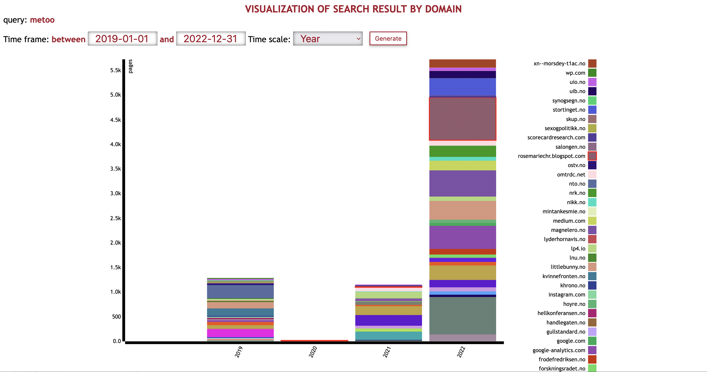
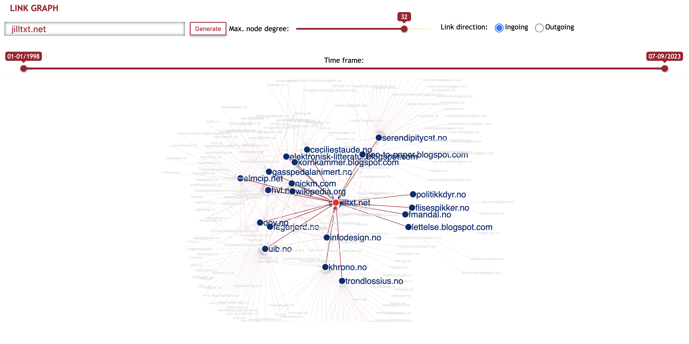
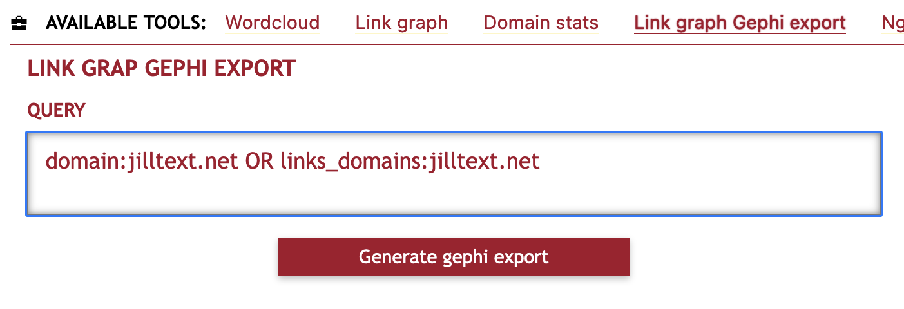
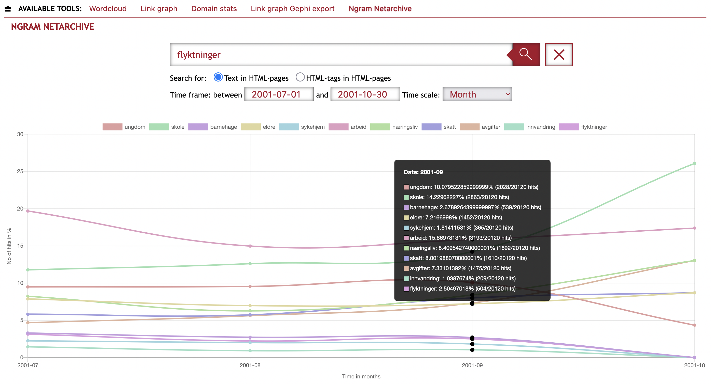

# Features & Tools
SolrWayback offer a range of features and tools that researchers can use to understand and analyse the data of the Norwegian Web Archive.
{: .fs-6 .fw-300 }

## Table of content
1. [Visualise search results](#visualise-search-results)
2. [Wordcloud](./wordcloud.md)
3. [Link graph](#link-graph)
4. [Link graph Gephi Export](#link-graph-gephi-export)
5. [Ngram](#ngram)
6. [Domain stats](#domain-stats)
7. [Export](./export.md)

## Visualise search results
To open the visualisation tool, click on the bar chart-icon next to "RESULTS".

The visualisation is based on statistics from your search results, and visualise the size of each domain. Size means the number of archived resources, combined with ingoing and outgoing links to/from that domain.

*An example of visualisation of search results for `metoo`*

## Wordcloud
*WARNING: We encourage you to only use Wordcloud for small domains. The Wordcloud generator demands a lot of memory and for large domains, it will take long time to generate.*

Wordcloud allow you to visualise the most common words on a specific domain. The bigger the word, the more frequent it is.

It operates with a Norwegian stop word list which remove common words like "å", "og", "en/ei/et", etc. The words displayed will be the most frequent word on that domain, with more frequent words displayed in a bigger font.

(If the returned image is black, it means SolrWayback could not find any text for that domain.)

## Link graph

Link graph is a tool to visualise the link relations between domains, and how different domains in the archive are clustered in spheres.

Enter the domain you want to examine. Choose whether you want to see ingoing links (other domains that links to this domain) or outgoing links (domains linked to from this domain). You can also adjust the time scope, visualising links in a certain period.

Click "Generate".

To adjust the number of nodes in the network, use the slider to increase or decrease the number of nodes in the network ("Max. node degree").

### Interaction
You can interact with the network graph in several ways.

**Zoom in / out**
You can either:
- scroll up/down,
- move two fingers up/down on your touchpad
- pinch/spread two fingers on your touchpad

**Highlighting**
To focus on a specific part of the network, you can click a node. This will highlight the other domains directly connected with this one, and suppress the rest of the network.

## Link graph Gephi Export

If you want to do more advanced analysis of document relations, SolrWayback offer the possibility to export data to Gephi. You need to define a query, based on what you want to analyse in Gephi.

To learn more about importing data from SolrWayback to Gephi, see the documentation page for [Gephi](../../docs/gephi)

### Queries for link export
Below are examples of queries used for certain types of analyses.

|Example|Query|
|Local neighborhood link graph for a domain.|`domain:wikipedia.dk OR links_domains:wikipedia.dk`|
|Complete domain link graph for a given crawl time interval|crawl_date:`[2015-01-01T00:00:00Z TO 2015-03-01T00:00:00Z]`|
|Extract complete top-level domain|`host_surt:"(uk,"`|
|Extract only domains based on text (on slashpage)|`text:"commodore 64" OR text:"commodore64" OR text:"commodore amiga"`|

### Limitations
Extraction will stop when reaching 1 million different domains.
Only extract links from 'slashpage' of a given domain: etc http://test.dk/ or http://test.dk/index.html
Only extract links once from a domain, will skip later hits from the same domain
This filter is added to the query: content_type_norm:html AND links_domains:* AND url_type:slashpage

## Domain stats
The domain stats offer visualisation of some basic statistics from a specific domain.

*DISCLAIMER: Since we have only indexed a few collections for this workshop, the data are far from complete. There will be variations and biases in these data that are hard to make sense of, without comprehensive knowledge about NWA's harvesting.*

*To get an overview of the data, we rather recommend you to define a [corpus of interest](../export#export-search-results), and analyse it with the Notebook for counting domains, content-type and crawl year.*

## Ngram

The Ngram viewer plot the frequency of selected words or phrases. This is useful if you want to map development of a phrase over time.

The frequency % is calculated by:

the number of html documents with match for word/phrase per {time-period} / total number of html documents per {time-period}

Since only a few number of collections are indexed, there will be holes and biases that are not always easy to make sense of. E.g., most of the indexed documents are from the NWA domain crawl, which is often harvested in late autumn. Before the rest of our collection is indexed, a word like "blogg" is therefore likely to occur far more in October-December, than in February.

One way to compensate for this is to choose "Year" as the time-period.

----

