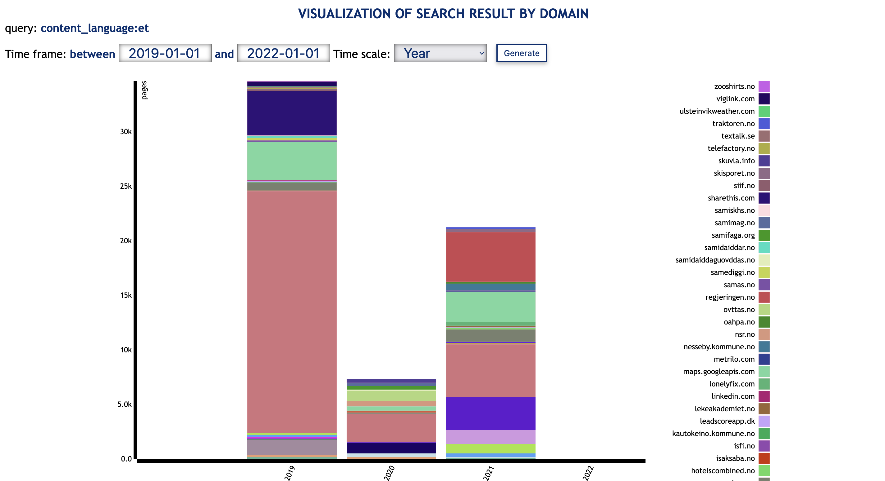

# Visualise search results

SolrWayback has a feature to visualise the search result. This way, you can get a general overview of how the results are distributed by year and domain.

To open the visualisation, click on the icon the the right of "RESULTS". 

## Wordcloud
Wordcloud allow you to visualise the most common words on a specific domain. The bigger the word, the more frequent it is.

It operates with a Norwegian stop word list and remove common words like "å", "og", "en/ei/et", etc.

(If the returned image is black, it means SolrWayback could not find any text for that domain.)

## Link graph
Link graph is a tool to visualise relations between domains.

Enter the domain you want to examine. Choose whether you want to see ingoing links (other domains that links to this domain) or outgoing links (domains linked to from this domain). You can also adjust the time scope, visualising links in a certain period.

Click "Generate".

To adjust the number of nodes in the network, use the slider to increase or decrease the number of nodes in the network ("Max. node degree").

### Interaction
You can interact with the network graph in several ways.

**Zoom in / out**
You can zoom in or out by scrolling up/down, or use pinching movements on your touchpad

**Highlighting**
You focus on a specific part of the network by clicking a node. This will highlight the other domains directly connected with this one, and suppress the rest of the network.

## Domain stats
The domain stats let you inspect what has been indexed from a specific domain

Lorem ipsum dolor sit amet, consectetur adipiscing elit, sed do eiusmod tempor incididunt ut labore et dolore magna aliqua. Ut enim ad minim veniam, quis nostrud exercitation ullamco laboris nisi ut aliquip ex ea commodo consequat. Duis aute irure dolor in reprehenderit in voluptate velit esse cillum dolore eu fugiat nulla pariatur. Excepteur sint occaecat cupidatat non proident, sunt in culpa qui officia deserunt mollit anim id est laborum.

## Link graph Gephi Export
Lorem ipsum dolor sit amet, consectetur adipiscing elit, sed do eiusmod tempor incididunt ut labore et dolore magna aliqua. Ut enim ad minim veniam, quis nostrud exercitation ullamco laboris nisi ut aliquip ex ea commodo consequat. Duis aute irure dolor in reprehenderit in voluptate velit esse cillum dolore eu fugiat nulla pariatur. Excepteur sint occaecat cupidatat non proident, sunt in culpa qui officia deserunt mollit anim id est laborum.

## Ngram
Lorem ipsum dolor sit amet, consectetur adipiscing elit, sed do eiusmod tempor incididunt ut labore et dolore magna aliqua. Ut enim ad minim veniam, quis nostrud exercitation ullamco laboris nisi ut aliquip ex ea commodo consequat. Duis aute irure dolor in reprehenderit in voluptate velit esse cillum dolore eu fugiat nulla pariatur. Excepteur sint occaecat cupidatat non proident, sunt in culpa qui officia deserunt mollit anim id est laborum.

----

