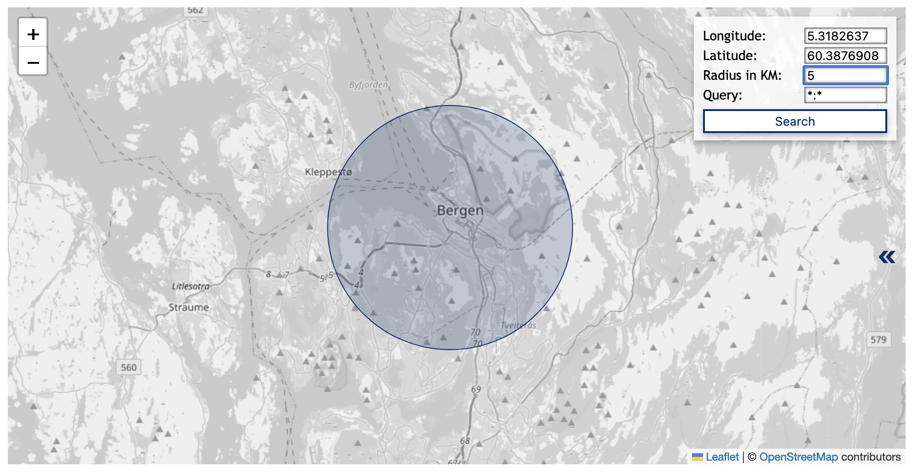

# Search modes
SolrWayback provide several different modes for search. This page give you an overview of the different modes, and how to use them.
{: .fs-6 .fw-300 }

#### Table of content
1. [Text search](#text-search) (default)
2. [Grouped search](#grouped-search)
3. [Image search](#image-search)
4. [Url search](#url-search)
5. [GPS Image Search](#gps-image-search)
6. [Search with uploaded file](#search-with-uploaded-file)

## Text search
Text search is the default mode. It is basicly a free text search, allowing you to search a variety of fields in the index.

For more information about to use text search, see [Search synthax](./search-synthax.md) and [Field descriptions](./fields).

## Grouped search
Grouped search mode will group the results by URL. When there are several matches with the same URL, only the most recent version will be presented in your list of result. This is particullary useful if you are not interested in different versions of the same document.

To activate this mode, check the "Grouped search" box below the search bar.

## Image search
Image search allow you to search for images in the context of text. Based on your query, SolrWayback will return up images that appear close to your search phrase in HTML pages.

To activate this mode, check the "Image search" box below the search bar.

## URL search
The URL Search mode is typically useful when you are searching for resources with a specific URL. It will encode the domain name and normalise the URL, searching for different representations of the URL.

To activate this mode, check the "URL search" box below the search bar.

## GPS Image Search
GPS Image Search allow you to search for images, based on a geographical scope. It will search through images with exif metadata about the location of capture. (Not all images contain exif geodata.)

*Open "GPS Image Search" by click on the link below the search bar.*

Because of the time used to fetch the images, the results are limited to 500.

### Defining a geographical scope
The most intuitive way to define the geographical scope is to interact with the map:
- Zoom in/out: Pinch/spread two fingers on your touchpad, or click the `+` or `-` icons.
- Define center of circumference: Click on the map.

You can also define the scope of your GPS image search by entering coordinate values for latitude and longitude. Full stop/period (`.`) is used as decimal separator.

EXAMPLE:
- Longitude: `12.34`
- Latitude: `64.23`
- Radius: `25`
- Query: `domain:ovttas.no`

### Adding query to geo-based image search
To further scope your geobased image search, you can also add a query.

This is done by entering the desired field and value in the query field on the format `{field}:{value}`. E.g. `domain:blogg.no`

### List all matched without fetching the images
It is possible to get a report of all images that matches your scope, without fetching and displaying the images.

This will allow you to make a list of all images within your scope, without the limit of 500 results.

To do this, you use a URL to calll the service: `https://nettarkivet.beta.nb.no/solrwayback/services/frontend/images/search/location/?query=*:*&latitude=56.17&longitude=10.20&d=50`.

To adapt your query, simply change the parameter values for query (`field:value`), latitude, longitude and d (diameter in kilometers) as preferred.

## Search with uploaded file
It is possible to search with an uploaded file.

However, since you currently not allowed to transfer files in to the service, the actual value of this mode is limited.

----