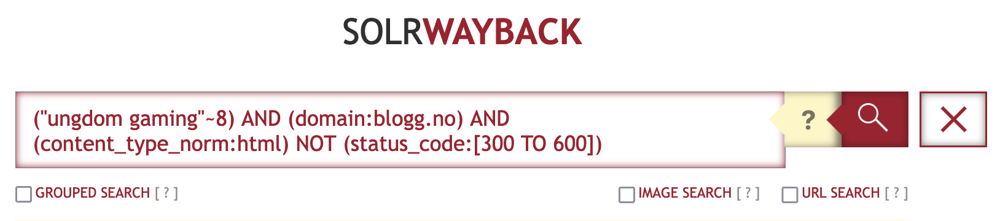

# Search synthax
SolrWayback have advanced features for search. Understanding its synthax will allow you to produce well-scoped search results.
{: .fs-6 .fw-300 }

## Table of content
1. [Boolean operators](#boolean-operators)
2. [Parentheses for mixing operators](#parentheses-for-mixing-operators)
3. [Using fields](#using-fields)
4. [Search phrases with quotation marks](#search-phrases-with-quotation-marks)
5. [Wildcards](#wildcards)
6. [Range search](#range-search)
7. [Default fields](#range-search)
8. [Field desriptions](#field-desriptions)

## Boolean operators
The boolean operators **AND**, **OR** and **NOT** are supported. They MUST be entered in uppercase, if not they will be considered as regular search words. 

|--- |--- |--- |
|**Operator**|**Example**|**Description**|
|AND|Støre AND Ukraina|Both terms must match.  Same as: Støre Ukraina AND is the default operator between terms if not specified|
|OR|Støre OR Ukraina|Any of the terms can match|
|NOT|Støre NOT Ukraina|Return matches on 'Støre' that does not include 'Ukraina'. Alternative syntax: Støre -Ukraina|

## Parentheses for mixing operators
If you mix several different operators, you should use parentheses () to avoid ambiguous interpretation. 
Example: <b>(Støre AND Ukraina) OR (Huitfeldt)</b>  
This will return results if either 'Støre AND Ukraina' or 'Huitfeldt' is found.

## Search for field value
You can refine your search considerably if you scope your query with fields. For a complete list of fields in the index, see [LINK](.)

Here are some examples of how you can use fields to limit your query:
- `domain:regjeringen.no AND Støre AND Ukraina` 
*resources from regjeringen.no, containing both 'Støre' and 'Ukraina'*

- `content_language:no AND makeup` 
*content classified as Norwegian language, containing the word 'makeup'*

- `content_type_norm:image` 
*resources classified as images*

- `collection:streetart2023 AND content_type_norm:image` 
*resources from the 'streetart2023' collection, classified as images*

## Search phrases with quotation marks
To search for phrases, simply put your search words within quotation marks.

- `"Støre og Zelenskyj"` will only return results where the words are next to each other.

You can also use the tilde character `~` to return hits with words appearing close to eachother.

- `"Støre Zelenskyj"~4` allows for up to 4 other words in between your search words.

Phrase search is also important when the text you are searching for contains special characters, like urls with `/`.
- links:"http://mittdomene.no/minside.html" will search for all resources containing links to that url.

## Wildcards
The search engine support the use of wildcard characters.

Asterisk (`*`) is used for trucation. E.g.
- `Universitets*` will return results for all words that starts with this, such as "universitetsbiblioteket" and "universitetslektor"

Question mark (`?`) is used as a joker character. This can be useful for words with variations in spelling. E.g.
- `Zelensk??` will return results for both "Zelenskij", "Zelenskyj" and "Zelenskyy".

**WARNING!** Do not use wildcards in the start of words (prefix). This often take too long time to resolve, and result in a timeout. 

## Range search
If you are search for a field where the value is numeric or a timestamp, you can specify a range of values to search for. E.g.:
- `content_type_norm:image AND content_length:[1000000 TO 10000000]` will search for images of size between 1-10Mb
- `crawl_date:[2022-12-01T00:00:00Z TO 2023-01-01T00:00:00Z]` will search for resources archived in January 2010. 
*(For more info about timestamps, see [LINK](.))*

## Default fields
When you search without a field prefix, you will only search in some default search fields.

These are the typical fields for text search, like `content_text`, `title`, `url` etc.

The default search fields are case insensitive. For some other fields, case must match.  

You should always use field prefix search if you want to search a non-default search field. E.g.
- `content_type_served:"image/jpeg"`