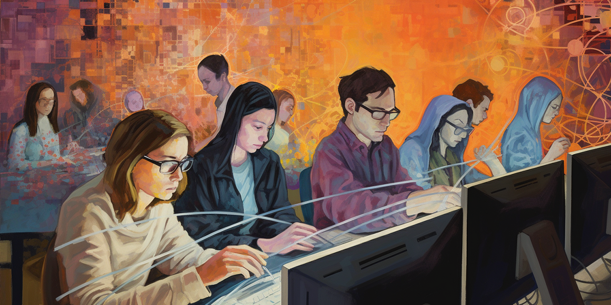

# Workshop on the Norwegian Web Archive
Welcome to this workshop, exploring data from the Norwegian Web Archive!

**When?**: 11 Sept, 11:30 - 12 Sept, 12:30 
**Where?**: The Humanities Library, Digital Lab 1st floor at [Håkon Sheteligsplass 7, Bergen](https://www.google.com/maps/search/?api=1&query=H%C3%A5kon+Sheteligsplass+7+Bergen) 
**How do I prepare?**:
- Bring your own computer
- Make sure you can access eduroam wifi
- Install [VMWare Horizon Client](https://www.vmware.com/go/viewclients) [^1]  

    
CLICK TO OPEN SCHEDULE

    <ul>
        <b>MONDAY 11 SEPT</b>
        <li>11:30 - 12:30: Talk: "Researching the Norwegian Web Archive: Challenges and Opportunities"</li>
        <li>12:30 - 13:00: Break</li>
        <li>13:00 - 13:30: Introduction to the services</li>
        <li>13:30 - 15:45: Hands-on exploration</li>
        <li>18:30: Dinner at <a href="https://www.google.com/maps/search/?api=1&query=Vaskerelven+8+Bergen">Kulturhuset</a></li>
         
        <b>TUESDAY 12 SEPT</b>
        <li>09:00 - 09:30: Introduction to NWA's Jupyter notebooks</li>
        <li>09:30 - 11:30: Hands-on exploration</li>
        <li>11:30 - 11:45: Break</li>
        <li>11:45 - 12:30: Wrap-up and discussion</li>
    </ul>

## Services
Our services for research is currently in development. And you will be the very first outside of the National Library to test it!

We can't guarantee that everything work as expected. There might be bugs, or some server hickup along the road. But we are eager to gain experience about its current value for scholars, and to learn more about how we can support the research community and solve the question of access.

These pages contains documentation of the services, with how-to-guides and explanation of the different tools and services we offer at the moment.
- **SolrWayback** - *free-text search, analytical tools and data export*
- **Maps** - *navigate among archived news sites in a map*
- **Jupyter Notebook** - *analyse and visualise your corpus*
- **Gephi** - *visualise networks*
- **Datasets** - *additional datasets and resources to support analysis*

## Terms and Conditions
Please read the [Terms and Conditions](./docs/terms-conditions.md) in advance.
By using the services, you agree to comply with these terms and conditions.

## About
The workshop is co-organised by the National Library of Norway, [Digital Lab](https://www.uib.no/en/digitallab) and [Centre for Digital Narrative](https://www.uib.no/cdn) at the University of Bergen.

----

[^1]: This is recommended, but not required. **Windows users** will find it in the "Software Center" on their computer. **Macintosh users** can install it themselves from [VMWare Horizon Client](https://www.vmware.com/go/viewclients). **Linux users** need to contact [Brita](https://www.uib.no/foransatte/78177/brita-hjelper-deg) to have it installed. (In case they have questions, refer to Alexi Santana.)

*The image above is created with MidJourney, entering the following prompt: `/imagine prompt: Painting in style of Munch of Media scholars with computers, surrounded by a matrix of code and --ar 2:1 --v 5 --chaos 30`*
